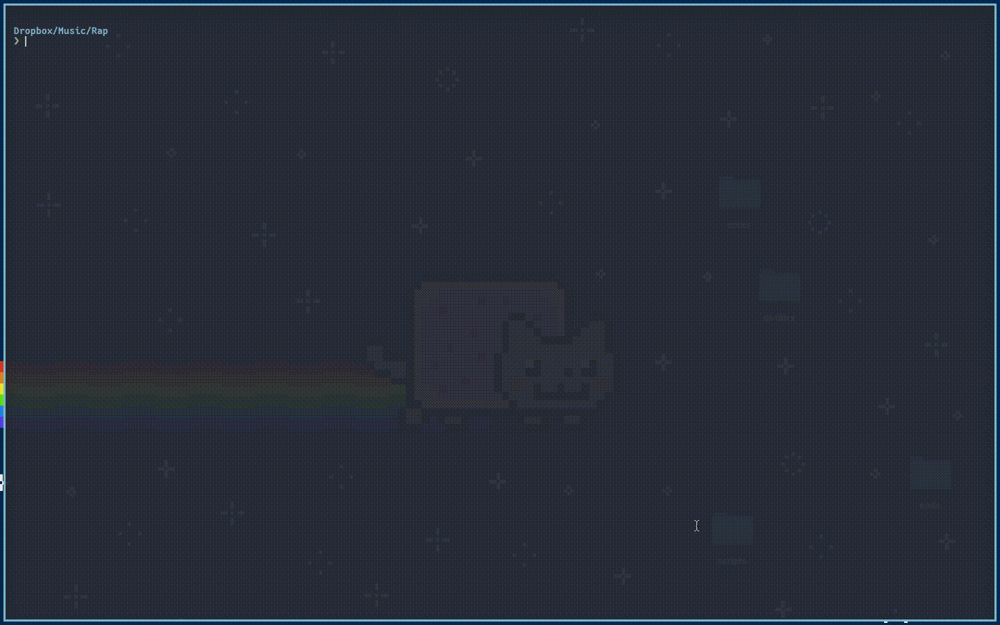

# Tagger



Tagger allows you to tag your mp3 files from the cmdline.
You can tag whole directories, single files and query tags.

### Contents

* [Installation](#installation)
* [Usage](#usage)
* [Dependencies](#dependencies)

### Installation

Install it with `go get`:

```
go get "github.com/orangefran/tagger/cmd/tagger"
```

The binary can be found in the `bin/` folder in your `GOPATH`.

Or you can clone the repository and build the executable manually.

``` bash
git clone "https://github.com/OrangeFran/tagger.git"
cd tagger && go run cmd/tagger/main.go
```

### Usage

Use the `help` subcommand to find out more about the command.
Alternatively you can read about possible flags and commands here.

__Query tags__

To query tags, use the subcommand `query` and pass in a target with `-t`.
If the target is a directoriy, all files of the directory get queried.

This will spit out each value that was set.

Look at the `help` command for more.

__Add tags__

Use the subcommand `tag` for that.

Specify your target with `-t`. It can be a file or a directory.
But keep in mind that for now it does not search recursively.

Now from where does `tagger` get the information to tag files. From the file name!
For that, you have to pass in a formatting string with `-f`.

There are five options avaible:

```

%a      -> artist
%t      -> title
%l      -> album
%y      -> year
%g      -> genre

```

For example, one format I often use is `%a - %t`.

If you first want to look what the binary does without
doing something to your files, you can use the `--dry-run` flag.
This won't tag your files. It will only output what would be tagged. 
If your pair this with the `-v` flag, you will get even more information to work with.

__Remove tags__

With `rm` you can remove tags from a file.
Specify the target with `-t` and the fields to remove.

Possible flags for that are:

```

--artist
--title
--album
--year
--genre

```

To get more outpu you can use the `-v` flag.

### Dependencies

Heavy use of the standard library.

* [cli](https://github.com/urfave/cli)
* [id3-go](https://github.com/mikkyang/id3-go)
